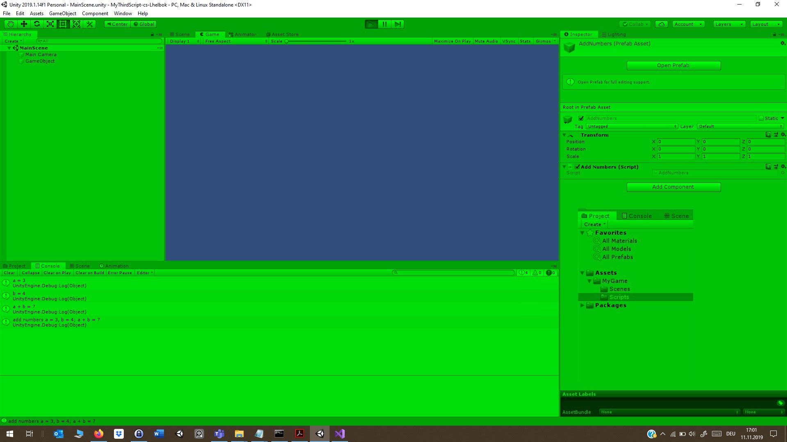

# MyThirdScript-cs-Lhelbok

### Project Description: 

The aim of this project is twofold. 
+ First, it serves practicing the git/GitHub workflow, including writing a meaningful REAMDE. 
+ Second, this is the first time using a debug message with concatinations of strings and variables. 

### Development platform: 

Windows 10 home, Unity version 2019.1.14f1, Visual Studio 2019

### Target platform: 

WebGL (RefRes: 1280x720 HD-720p)  

### Lessons Learned

+ Learned how to format and layout a REAMDE.md and how to embedded a screenshot
+ Got faster at the git/Github Workflow
+ Gained extra knowledge from my mistakes

### Screenshots:

 

*copyright by Lhelbok*
